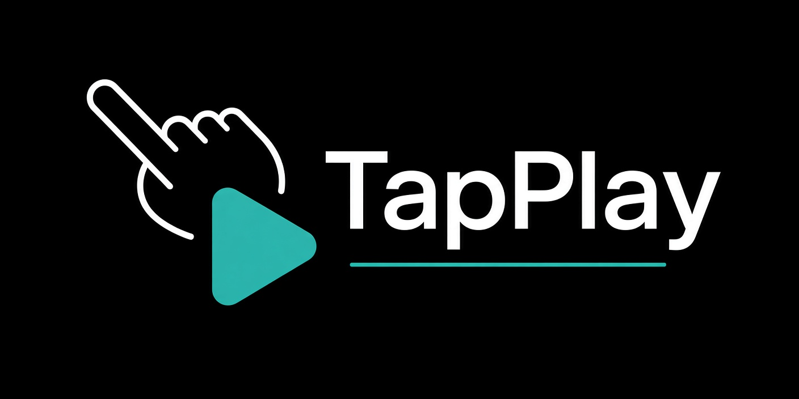
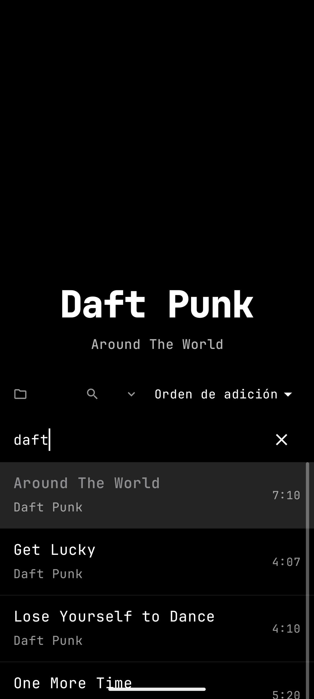

# TapPlay

Reproductor de música offline ultra-minimalista para Android. Una pantalla. La carátula es la interfaz: abrir → tocar → escuchar.

<p align="center"></p>


## Capturas de pantalla

| Canción actual | Reproducir | Pausa | Listado de canciones |
| --- | --- | --- | --- |
|  |  |  |  |

## Características

**Reproducción y gestos**

- Reproducción local por carpetas vía SAF (`DocumentFile`), sin permisos de almacenamiento globales.
- Player de una pantalla guiado por gestos: tap en zonas (seek ±10 s / play-pause), doble tap (anterior/siguiente), presión larga (reiniciar pista), swipes horizontales y arrastre vertical para el volumen (el dedo funciona como slider).
- Servicio de reproducción con `MediaSession`: notificación del sistema, restauración de sesión en pausa y volumen persistente.
- Interfaz de texto puro sobre negro: tipografía JetBrains Mono variable, artista como protagonista (46sp), modos claros de fallback determinista derivados del nombre de archivo.

**Cola inteligente**

- Cola completa en una sheet a media pantalla con scrollbar propia: búsqueda por nombre o artista, tap para saltar y drag-to-reorder con persistencia.
- Orden por agregado, artista, fecha de modificación o fecha de agregado a biblioteca, con toggle ascendente/descendente.
- Filtro que reproduce sobre la sublista filtrada; al limpiarlo vuelve la cola completa.

**Rendimiento**

- Escaneo paralelo del árbol SAF: recorrido con múltiples lectores concurrentes y extracción de metadata con pool de workers (Semaphore para acotar la concurrencia).
- Caché de metadata persistente: los re-escaneos son casi instantáneos.
- Carga progresiva con indicadores: indeterminado durante el recorrido, determinado ("Cargando biblioteca n/m") durante la extracción.

**Persistencia**

- Snapshot de la cola persistido: al reabrir la app se restauran cola, canción y posición exactas sin escanear nada.
- Preferencias (volumen, orden, filtro) en `SharedPreferences`.

## Arquitectura

App de un solo módulo Kotlin con MVVM simplificado: un `PlaybackManager` singleton de alcance de aplicación sobre el `MediaController` de Media3, estado unidirecional (`PlayerUiState` expuesto como `StateFlow` hacia Compose) y un escáner SAF con concurrencia acotada. Caché y snapshots viven en `SharedPreferences`.

```
com.tapplay
├── ui/        # Compose: player de una pantalla, cola, temas
├── player/    # PlaybackManager, MediaSession, gestos
├── scanner/   # Recorrido SAF paralelo y extracción de metadata
├── model/     # Canciones, cola y estado de UI
└── util/      # Persistencia, formateo y helpers
```

## Requisitos y compilación

- JDK 21 (la ruta se fija con `org.gradle.java.home` en `gradle.properties`)
- Android Studio (o solo el SDK, línea de comandos)

```bash
# Windows
gradlew.bat assembleDebug

# Linux / macOS
./gradlew assembleDebug
```

El APK se genera en `app/build/outputs/apk/debug/`.

## Uso

1. Abrir la app y elegir la carpeta donde está la música (acceso vía SAF, sin permisos globales).
2. Tap en zonas laterales: seek ±10 s. Tap central: play/pausa.
3. Doble tap: pista anterior/siguiente. Presión larga: reiniciar la pista.
4. Arrastre vertical: volumen (el dedo es el slider). Swipes horizontales: navegación.
5. Tap en la cabecera: cola con búsqueda, orden y reordenamiento por arrastre.

## Roadmap

- [ ] MediaStore como fuente indexada complementaria al escaneo SAF.
- [ ] Fecha de creación real de pistas vía MediaStore.
- [ ] UX dedicada para carpeta vacía (estado inicial sin resultados).
- [ ] Auto-scroll de la cola durante el drag-to-reorder.
